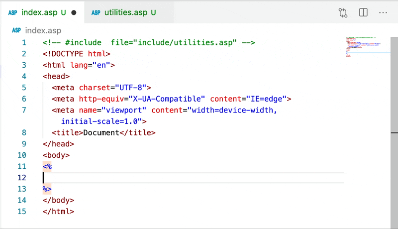

# ASP Classic Support - an extension for VS Code

Includes syntax highlighting, intellisense, and code navigation for VBScript inside Active Server Pages (ASP) files.

## Features

The example below shows some initial features included. Support/docs for built-in VBScript functions is included but more is on the way for built-in ASP objects and functions.

## Known Issues

The extension is in a pre-release state that is hopefully more useful than no extension at all. Please feel free to submit issues for bugs and enhancements as you see fit!

## Made Possible By

This extension is derived directly from the [VBS extension by Serpen](https://marketplace.visualstudio.com/items?itemName=Serpen.vbsvscode) with syntax highlighting for ASP files from the [Classic ASP Syntaxes and Snippets extension by Jintae Joo](https://marketplace.visualstudio.com/items?itemName=jtjoo.classic-asp-html).